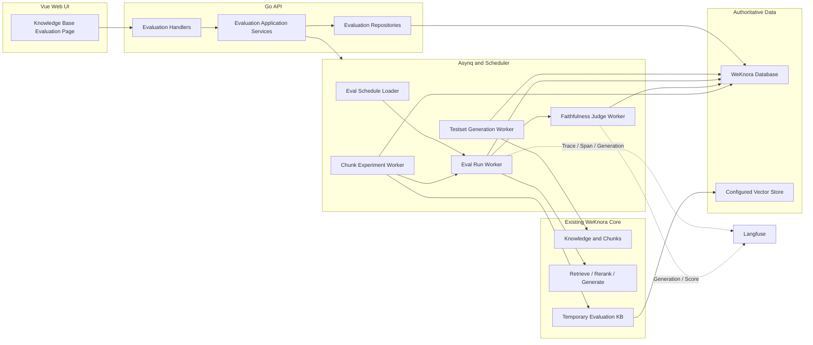
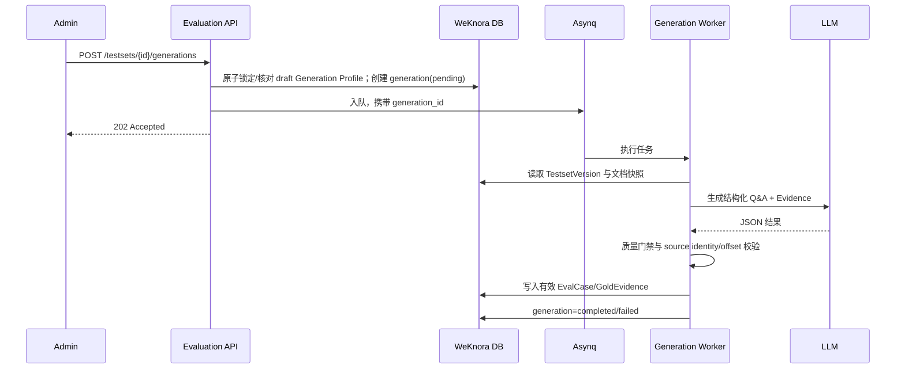
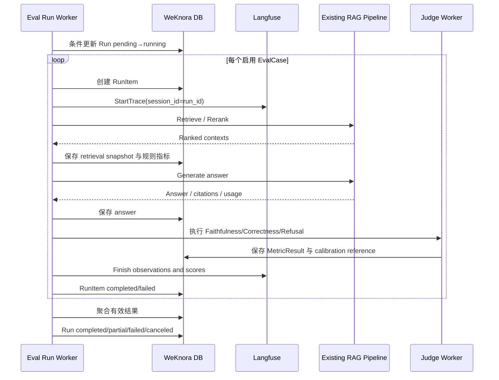
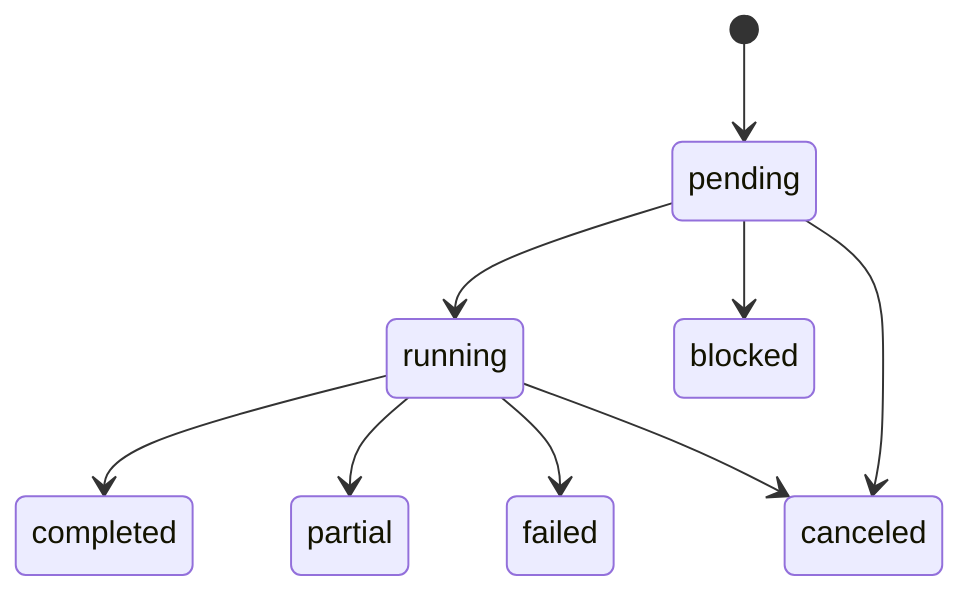

# WeKnora RAG 评测与 Chunking 策略推荐架构

## 1. 架构目标

本架构只服务以下闭环：

```text
文档 → 测试集 → 真实 RAG 运行 → 检索/忠实度指标 → Langfuse 观测
    → Web 仪表盘 → 临时 Chunking 对比 → 推荐
```

核心约束是可复现、可持久化、租户隔离和 MVP 不修改活动知识库。人工确认、应用、重解析、索引切换和回滚属于非 MVP 增强阶段，并因底层能力尚未完成原型统一标记 **Pending Verification**。

## 2. 现有能力与最小改造边界

| 现有能力 | 事实路径 | 本设计中的使用方式 |
| --- | --- | --- |
| 现有评测 Handler/Service | `internal/handler/evaluation.go`、`internal/application/service/evaluation.go` | MVP 不依赖旧接口迁移；新子资源使用持久化模型，旧路由兼容适配为非 MVP、**Pending Verification** |
| 真实 RAG 链路 | `internal/application/service` 下的检索、重排和生成服务 | Eval Worker 复用，不另建平行 RAG 实现 |
| Chunking 配置 | `internal/types/knowledgebase.go` | 每次运行冻结实际生效配置和哈希 |
| 异步队列 | `internal/types/task.go` 及现有 Asynq 初始化 | 增加评测、Judge 和实验任务类型 |
| cron 调度 | `internal/datasource/scheduler.go` | 复用调度生命周期和确定性 Task ID 思路 |
| Langfuse | `internal/tracing/langfuse` | 复用 Trace/Span/Generation，最小补足 Score 写入 |
| Vue 路由与 API 模式 | `frontend/src/router/index.ts`、`frontend/src/api` | 增加知识库级 evaluation 路由、API 模块和页面 |
| RBAC/KB 访问控制 | `internal/middleware/kb_access.go` 等 | 所有新资源复用 tenant 与 KB 权限校验 |
| Audit Log | 现有 tenant audit 能力 | 记录发布、运行、调度和实验等关键动作 |

当前评测的内存 Map 和裸 goroutine 不能继续作为正式任务状态源。它们只作为旧 API 迁移事实，不成为新架构的一部分。

## 3. 组件视图



## 4. 模块职责

### 4.1 Evaluation Handler

- 绑定和校验请求。
- 执行 tenant context 和现有知识库 read/write access 检查；精确角色常量与新增 API Key capability 映射为 **Pending Verification**。
- 使用仓库实际响应/错误适配器返回 HTTP 状态；成功包络字段、错误码类型和具体整数码在源码原型确认前均为 **Pending Verification**，领域只冻结稳定字符串 reason code。
- 不在请求生命周期内执行 LLM、RAG 或文档处理。

### 4.2 Evaluation Application Service

- 管理 Testset、Version、Case、Schedule、Run、JudgeCalibration、Experiment 和 Recommendation 生命周期。
- 在异步任务入队前完成持久化和幂等校验。
- 创建运行快照并执行 readiness gate。
- 聚合结果，但不重新实现检索或生成算法。

### 4.3 Evaluation Repositories

- 对评测逻辑实体提供 tenant-aware 的持久化访问。
- 提供状态条件更新，避免取消、重试和 Worker 完成之间互相覆盖。
- 为调度时间槽和幂等键提供唯一性约束。
- 复用现有数据库和事务方式，不引入第二业务数据库。

### 4.4 Workers

- **Testset Generation Worker**：读取选定文档，调用 LLM，解析结构化 Q&A，执行 Schema、重复、答案泄漏、歧义、可回答性和 claim-evidence support 门禁后写入草稿。
- **Eval Run Worker**：逐 Case 调用真实检索、重排和生成链路，保存检索快照与回答。
- **Judge Worker**：按 Case answerability 执行 Faithfulness、Correctness 或拒答质量，结果直接写入 MetricResult；不建立独立 JudgeExecution 业务实体。
- **Diagnosis Worker**：在指标聚合后排除测试集、解析、模型、Rerank、生成与未校准 Judge 原因，输出稳定诊断标签、reason codes 和证据。
- **Chunk Experiment Worker**：建立临时评测知识库、按 Variant 解析和索引文档、触发相同 EvalRun、比较结果并清理资源。

Judge 可以使用独立低并发队列，避免 LLM Judge 堵塞普通文档处理任务，但不建设通用预算平台。

### 4.5 Scheduler

- 加载启用的 EvalSchedule；cron 的正式字段数与解析语法以当前 scheduler 源码原型为准，当前为 **Pending Verification**。
- 使用 Schedule ID 和标准化计划时间原子创建 `EvalScheduleSlot`，唯一键为 `schedule_id + scheduled_at_utc`；已存在时幂等返回。占用刚完成时 `outcome` 可短暂为空，这只是内部 claim 阶段，不是第四种业务 outcome。
- 占用 Slot 后才检查 active Run。命中 `skip_if_active` 时把 Slot 更新为 `skipped_active/SCHEDULE_SKIPPED_ACTIVE`，不创建 EvalRun；否则以同一事务创建 EvalRun，并把 Slot 更新为 `run_created` 及关联 Run ID。
- 在 Slot 已占用但 Run 尚未创建时发生的可持久化错误记录为 `failed_before_run`；Worker/进程中断留下的超时 claim 在恢复时必须终结为 `failed_before_run/SCHEDULE_SLOT_INTERRUPTED`，不得补建 Run。不能仅用 Schedule `last_status` 代替历史 Slot。
- Schedule 保存完整、明确版本的 Run 模板和确定性采样算法/seed，触发时解析并冻结到 Run snapshot，不隐式读取“最新”模型、Prompt 或 Calibration。
- 调度本身不复制评测逻辑。

### 4.6 Langfuse Adapter

- 保持当前环境变量启用方式和禁用时 no-op 行为。
- 复用现有异步 ingestion buffer。
- 增加最小 Score 事件能力，Score 至少包含 `trace_id`、名称、数值、可选说明和指标版本。
- Langfuse 失败只写日志/内部观测状态，不回滚已持久化业务结果。
- 不读写 Langfuse Dataset 或 Experiment。

## 5. 测试集生成数据流



### 5.1 Draft Generation Profile Lock

- 新建 Testset 或无 base version 的 Version 时允许产生空 draft；此时 document snapshot、normalization/offset、split 和 generator 摘要字段均可为空。
- 第一次合法 Generation 请求被 API 成功接纳并持久化时，在同一事务内锁定文档集合及 hash、`offset_unit`、`source_normalization_version`、split algorithm/seed、generator model 和 generator Prompt version/hash，并保存 profile hash、首个 generation ID 与锁定时间。
- 同一 draft 后续 Generation 必须提交完全相同的规范化 Profile；不一致返回 409/`GENERATION_PROFILE_CONFLICT`，不得静默合并或覆盖。
- Generation 后续 failed/canceled 不解除 Profile Lock；需要不同范围或配置时创建新 draft Version。
- Case 与 TestsetGeneration 保存具体 provenance；Version 级 generator 字段只保存一致配置摘要。发布前 Profile 必须完整且可重新计算 hash。

### 5.2 Evidence 校验

生成结果中的证据定位必须满足：

1. `source_document_id` 属于本次生成选定范围。
2. 当前文档 `file_hash/content_hash` 与生成快照一致。
3. Evidence 的 `offset_unit` 与文档快照一致，且 `0 <= start_at < end_at <= normalized_source_length`。
4. Evidence 与文档使用相同 `source_normalization_version`，规范化后的源区间文本与 evidence snapshot 一致。
5. evidence content hash 可重算并一致。
6. answerable Case 的 reference claims 都能被 Evidence 支持；unanswerable Case 保存 `checked_scope`、reason code，且不能仅依赖 LLM 自述“文档没有提到”。

`offset_unit` 的具体值和可支持文档类型不能从当前源码直接确认。每种文档类型必须先通过“原文→规范化文本→offset→重解析回查”原型；未通过的类型标为 **Pending Verification**，不能进入 MVP 发布范围。

任一条件不满足的 Case 不写入草稿，错误计入 generation 结果。不能以当前 Chunk ID 代替源位置。

## 6. EvalRun 数据流

### 6.1 创建与冻结

创建运行时完成以下检查：

- 调用者具有目标知识库权限。
- TestsetVersion 已发布且至少包含一个启用 Case。
- 关联文档仍存在，且哈希与发布快照一致。
- 文档解析状态为 completed。
- Embedding、生成和 Judge 模型可用；指定 Rerank 模型时同样检查。
- 指标 K 合法且已排序去重。

通过检查后，Run snapshot 固定保存：

- tenant、KB、TestsetVersion、Case 集合和文档哈希。
- source normalization version、offset unit、source/execution document identity mapping、split algorithm/seed。
- 实际生效的 Chunking 配置及规范化哈希。
- Embedding、Rerank、生成、Judge 模型 ID/名称/配置版本及 temperature、top_p、max_tokens、seed、threshold/top_n、embedding dimension 等可用关键参数。
- Testset generator、真实 RAG answer、Judge Prompt 的 version/hash。
- 上下文构造版本和固定 `no_history` 策略：每个 Case 使用新会话，不携带历史消息。
- Judge calibration version/status、检索参数、指标 K、代码 commit/release。
- 触发来源、调度时间或实验 Variant。
- `evaluation_data_policy` version/hash，以及是否允许外部 Judge、Langfuse Question/Context/Answer 的发送模式和第三方模型接收敏感片段的许可。

不可恢复的资源前置条件错误在 Run 能可靠持久化时创建 `blocked` Run，并以 HTTP 202 返回；请求方仍可通过 Run API 查看原因。只有数据库、队列或核心服务使请求无法被可靠接纳和持久化时才返回 503，且不得返回新 Run ID。

创建 RunItem 时必须冻结足以脱离 EvalCase 表复算的输入：`answerability/question_type/difficulty`；answerable 的 reference answer、key points 和非空 Gold Evidence；unanswerable 的 expected refusal、reason code/reason、checked scope，且 reference answer 与 Gold Evidence 为空。

### 6.2 执行顺序



业务数据先写 DB，再尝试 Langfuse。Langfuse ingestion 是异步 best effort，不参与业务事务。

### 6.3 取消与重试

- `cancel` 对终态 Run 为幂等成功。
- Worker 在 Case 边界检查取消标记，不强行中断已发出的模型请求。
- 未开始的 Item 标记 canceled；已完成结果保留。存在 completed Item 且同时存在 failed/canceled Item 时 Run 为 `partial`；用户取消且没有 completed Item 时 Run 为 `canceled`。
- `retry` 不修改旧 Run，而是创建 `parent_run_id` 指向旧 Run 的新 Run，并冻结 `retry_scope` 与精确 Case ID 集。
- `failed` scope 只选择 failed Item；`unfinished` 选择 pending/running/canceled Item；`all` 选择全部原计划 Case。
- partial 支持 `failed/unfinished/all`；canceled 支持 `unfinished/all`；failed 支持 `failed/all`；blocked 只支持 `all`；completed 不允许 retry。
- 新 Run 复用旧 snapshot 中除 Case 选择外的全部固定变量；若调用方要改变模型、Prompt 或配置，必须创建普通新 Run，而不是 retry。旧 Run 与已完成 Item 永不被覆盖或原地复活。

## 7. 状态模型

### 7.1 EvalRun



- `completed`：所有应执行 Item 完成，指标可用或按定义标为 invalid/abstain。
- `partial`：至少一个 Item 完成且至少一个 Item 执行失败或取消。
- `failed`：没有 Item 产生可用结果，或 Run 级不可恢复错误发生在执行期。
- `blocked`：创建或启动前的依赖/快照检查失败。
- 所有终态不可回到 running。

运行阶段使用独立 `stage` 字段表示 `preparing/retrieving/generating/judging/aggregating`，不扩充状态枚举。

### 7.2 TestsetVersion

```text
draft → published → archived
```

- 只有 draft 可编辑。
- published 不可修改，且同一 Testset 同时只有一个 `current_published_version_id`。
- archived 版本仍可被历史 Run 引用，但不能用于新 Run。MVP 不提供独立 Version archive API；Version 只随 Testset 归档进入 archived，不能通过 PATCH 恢复。

### 7.3 ChunkExperiment

```text
draft → running → completed | failed | canceled
draft → canceled
```

实验运行完成但不满足推荐门槛时仍为 completed，并持久化 `decision=no_better_strategy` 与失败门槛；不能用空 Recommendation 隐去结论。

### 7.4 TestsetGeneration、JudgeCalibration、FailureDiagnosis 与 Schedule

- TestsetGeneration：`pending → running → completed|partial|failed|canceled`；提供显式 cancel API，终态不可恢复。重新生成创建新 Generation。
- JudgeCalibration：`draft|failed → running → passed|failed`。MVP Judge 仅为 Pointwise；`run` 支持幂等，running 重复调用返回同一执行或 409，passed 后模型/Prompt/Parser 变化必须新建 Calibration Version。MVP 不保留 archived 状态。
- FailureDiagnosis：`pending → running → completed|failed`。Run 聚合后自动创建，或通过显式 create/retry API 创建新记录；failed retry 不原地覆盖旧记录。只有 `completed + chunking_likely` 可作为 Experiment 前置。
- EvalSchedule：POST 由服务端固定 `status=active`；PATCH 只能修改可编辑模板和 `enabled`，不能提交任意 status；DELETE 执行 `active→archived`。archived 是终态，恢复时创建新 Schedule。
- EvalScheduleSlot：原子创建后的内部 claim 阶段允许 `outcome=null`，随后必须以 `run_created/skipped_active/failed_before_run` 之一结束；中断 claim 恢复为 `failed_before_run`。不提供修改最终历史结果的 API；相同 `(schedule_id, scheduled_at_utc)` 永远复用同一 Slot。
- ChunkExperimentVariant：`pending→preparing→running→completed|failed|canceled`；父 Experiment 在 draft/running 被取消时，尚未终结的 Variant 级联为 canceled，不提供 Variant 独立 cancel/retry API。

## 8. Schedule 与幂等

### 8.1 调度时间槽

专用实体 `EvalScheduleSlot` 的唯一键为：

```text
schedule_id + scheduled_at_utc
```

`scheduled_at_utc` 是 cron 在配置时区中求值后转换的 UTC 时间。执行顺序固定为：

```text
Scheduler 触发
→ 原子创建/占用 EvalScheduleSlot
→ Slot 已存在则幂等返回
→ 检查 active Run
→ 有 active Run：Slot=skipped_active/SCHEDULE_SKIPPED_ACTIVE，不创建 Run
→ 无 active Run：创建 Run，Slot=run_created 并关联 run_id
→ Run 创建前发生可记录错误：Slot=failed_before_run
→ claim 后进程中断：恢复为 Slot=failed_before_run/SCHEDULE_SLOT_INTERRUPTED，不补建 Run
```

重复加载调度器、进程重启或 Asynq 重试都必须命中同一 Slot；被跳过的时间槽不能在重启后补建 Run。Schedule 的 `last_status` 只是缓存，不能替代 Slot 历史。

### 8.2 可复现 Schedule 模板

Schedule 必须保存明确版本的完整 Run 模板：TestsetVersion、文档/数据策略引用、Embedding/Rerank/answer/Judge 模型及关键参数、Judge calibration versions、真实 RAG answer Prompt version/hash、context builder、`no_history`、retriever/rerank 参数、top_k、metric version、sample selection algorithm/seed、sample_limit 和 `skip_if_active`。触发时只解析该模板并冻结到 Run，不读取隐式“最新”值。

当 `sample_limit` 小于 enabled Case 数时，MVP 使用版本化稳定哈希排序：`hash(sample_seed || case_id)` 升序，Case ID 作为并列键，取前 N。所有 Worker 必须消费 Scheduler 已冻结的 Case ID 列表，不得自行抽样。

### 8.3 HTTP 幂等

以下操作接受 `Idempotency-Key`：

- 测试集生成。
- 创建 EvalRun。
- Schedule 立即触发。
- Run 重试。
- Experiment 启动。

幂等记录的具体保存实现与期限标记 **Pending Verification**。契约要求同一 tenant、操作和 key 的相同请求返回原资源，请求体摘要不同返回 conflict。

## 9. ChunkExperiment 架构

### 9.1 诊断规则与触发条件

- MVP 仅支持具备 KB 写权限的主体从 `completed + chunking_likely` FailureDiagnosis 手动创建实验；一个 Experiment 只绑定一个 `source_run_id` 和该 Run 的一个 Diagnosis。
- `non_chunking_likely`、`unknown`、pending/running/failed Diagnosis 不允许创建实验，API 返回稳定 reason 并保留诊断证据。
- blocked Run 可以生成 `non_chunking_likely` 或 `unknown`，不得生成 `chunking_likely`。
- 连续低分自动创建草稿属于非 MVP；将来即使实现，也必须先通过相同门禁。

版本化最小决策顺序固定为：

```text
测试题/Gold 是否有效
→ 文档是否解析和索引成功
→ 检索是否命中
→ Rerank 是否丢失 Gold
→ Retrieved Context 是否已充分
→ Generator 是否仍失败
→ 是否出现 Chunk 边界、尺寸、标题或冗余信号
→ 输出 diagnosis label
```

Diagnosis 必须保存 `diagnosis_version/status/target_k/eligible_case_count/valid_case_count/reason_codes/evidence_signals/generated_at/error`。稳定 reason code 至少包括 `GOLD_EVIDENCE_INVALID`、`DOCUMENT_PARSE_INCOMPLETE`、`DOCUMENT_NOT_INDEXED`、`EMBEDDING_OR_SEARCH_FAILURE`、`RERANK_DROPPED_GOLD`、`CONTEXT_COMPLETE_GENERATION_FAILED`、`CHUNK_BOUNDARY_SPLIT`、`CHUNK_TOO_LARGE_NOISY`、`CHUNK_TOO_SMALL_INCOMPLETE`、`HEADING_BODY_DETACHED`、`CROSS_EVIDENCE_NOT_CO_RETRIEVED`、`TOPK_REDUNDANCY_HIGH`、`INSUFFICIENT_VALID_CASES`、`UNKNOWN_CAUSE`。

### 9.2 候选生成

baseline 来自源 Run 中冻结的实际配置，不使用代码默认值。MVP 候选总数为 1–2，相同规范化配置哈希去重，`recursive` 当前不作为独立候选。候选维度必须由 Diagnosis reason 限制：

| reason code | 允许变化 |
| --- | --- |
| `CHUNK_TOO_LARGE_NOISY` | 减小 chunk size，或测试更结构化且当前真实不同的策略 |
| `CHUNK_TOO_SMALL_INCOMPLETE` | 增大 chunk size，或调整已存在的父子上下文配置 |
| `CHUNK_BOUNDARY_SPLIT` | 增加 overlap 或增大 size |
| `TOPK_REDUNDANCY_HIGH` | 降低 overlap |
| `HEADING_BODY_DETACHED` | 测试 `heading` strategy |
| `CROSS_EVIDENCE_NOT_CO_RETRIEVED` | 仅在诊断证据同时指向 size/父子上下文时调整相应维度 |

其他 reason 不得生成通用候选网格。策略仍只从 `auto/heading/heuristic/legacy` 中选择当前确实不同的实现；参数必须受现有 Chunking 校验范围约束。

### 9.3 隔离方式

每个 Variant 创建专用临时评测知识库，继承源知识库的模型和检索设置，但使用 Variant Chunking 配置。每份复制文档都保存 `source_document_id ↔ execution_document_id`、source file/content hash、offset unit 和 normalization version。Retrieved Context 保存 execution Chunk 身份，同时通过映射还原 source document/hash/offset；Metrics 只能使用还原后的 source identity 匹配 Gold Evidence。

活动知识库的配置、Chunk 和索引不会被覆盖。临时资源清理失败必须记录，但不能删除已持久化的实验结果。

### 9.4 tuning/holdout 两阶段

1. baseline 与全部 candidate 在 tuning Case 上运行，使用共同 valid Item 比较。
2. tuning 按硬门禁和确定性排序选择且只选择一个 `provisional_candidate`。
3. holdout 只运行/比较 baseline 与 provisional candidate。
4. holdout 只能输出 pass/reject，不能把其他候选重新引入或改变 provisional selection。
5. split algorithm、seed 和每个 Case split 冻结在 TestsetVersion 与 Experiment snapshot。

### 9.5 推荐规则

Recommendation 只在 baseline/provisional 的同一 eligible holdout 集合上评估，并保存每个门禁指标的 `eligible_count`、baseline/candidate valid count、common valid count、双方 invalid/abstain/failed count 与排除原因。MVP `allowed_drop=0`，即 candidate 的 valid coverage 不得低于 baseline，防止通过制造更多 invalid 选择性提高均值。

Recommendation 仅在 holdout 结果同时满足以下条件时产生：

- 共同有效 holdout 样本数不少于 30。
- 目标 Context Precision 至少比 baseline 高 0.03。
- Evidence Recall 和 Gold Coverage 均不得低于 baseline（delta >= 0）。
- 参与门禁的 Faithfulness、Correctness、拒答质量必须绑定 passed calibration，且各不得下降超过 0.02。
- Variant 没有 Run 级失败，且失败率不高于 baseline。
- candidate valid coverage 不低于 baseline valid coverage。

MVP 采用资源方案 B：Chunk Redundancy、chunk count、index build time、P95 延迟、Token 以及可获得的 embedding/index 成本必须展示，并可用于 tuning tie-break，但不参与 holdout pass/reject。holdout 未通过时持久化 `no_better_strategy` 和失败门禁，不能继续挑选另一个候选。Recommendation 在 MVP 没有 apply 行为。

### 9.6 成本与并发保护

- 单个 EvalRun 硬上限 100 Case。
- 单个 Experiment 最多两个 candidate，总 Variant 不超过 3。
- 每 tenant 默认最多 2 个 active EvalRun 和 1 个 active Experiment；部署配置键与跨进程原子计数方式标记 **Pending Verification**，但 API 必须以 429 表达超限。
- Experiment 启动前必须返回预计文档解析数、估算 chunk/embedding 数、RAG 调用数、Judge 调用数和可获得的成本范围；用户确认启动仅确认本次高成本运行，不等于应用推荐。

## 10. Langfuse 观测模型

每个 RunItem 使用一个 Trace：

```text
Trace: rag-evaluation.item
  metadata: tenant_id, kb_id, run_id, item_id, case_id, versions
  Span: retrieval
  Span: rerank (可选)
  Generation: answer
  Generation: faithfulness-judge
  Generation: correctness-judge
  Generation: refusal-judge (unanswerable only)
  Score: context_precision@5
  Score: context_precision@10
  Score: hit@5 / hit@10
  Score: evidence_recall@5 / @10
  Score: mrr@5 / @10
  Score: gold_coverage@5 / @10
  Score: chunk_redundancy@5 / @10
  Score: faithfulness
  Score: answer_correctness
  Score: unanswerable_refusal_quality
```

输入输出还必须受 Run 冻结的 `evaluation_data_policy` 约束。策略至少决定：是否允许外部 Judge、Langfuse 是否可保存原始 Question、完整 Retrieved Context、完整 Answer，是否仅保存 ID/hash/长度/脱敏摘要，以及是否允许第三方模型接收敏感片段。

真实 KB 敏感级别到策略的映射为 **Pending Verification**。在此之前，受限 KB 使用安全默认值：禁止外部 Judge；Langfuse 的 Question/Answer 仅发送脱敏值或 hash，Context 仅记录内部 correlation ID、source ID、hash、rank、长度和脱敏摘要；内部 DB 只保存业务所需最小结果；没有合规私有 Judge 时 Judge Metric 标记 invalid/blocked，不伪造分数。不得保存模型无界长推理，只保存简短 reason、claim verdict 和 evidence ID。

## 11. Web 架构

- 路由：`/platform/knowledge-bases/:kbId/evaluation`。
- API 模块：沿用 `frontend/src/api/*` 的请求封装和统一错误处理。
- 状态管理：页面级查询状态即可；只有需要跨区域共享的当前 Testset/Run 筛选进入 Pinia。
- 页面区域：Overview、Testsets、Runs、Run Detail、Chunk Experiments、Schedules/Slots。
- 进度：运行时定期轮询 Run/Generation/Experiment 状态；本范围不新增 WebSocket/SSE 协议。
- 图形：优先使用 TDesign 卡片、表格、进度条及轻量 CSS/SVG 展示，不以引入大型图表平台为交付前提。

## 12. 权限与租户隔离

每次访问都必须同时满足：

1. 请求具有仓库当前实际支持的有效 tenant context。
2. 资源 `tenant_id` 与有效 tenant 一致。
3. principal 对资源 `knowledge_base_id` 具备所需的现有 read/write access。

列表查询不能先返回跨租户行再在应用层过滤。Worker payload 只携带业务资源 ID，Worker 启动时重新从 DB 读取 tenant 和快照，不信任 payload 中的任意配置。

`CODEBASE_MAP.md` 没有充分证明 Owner/Admin/Contributor/Viewer、`FullAccess`、`run_evaluations`、新增 API Key capability、整数错误码或成功响应包络在新端点上的精确契约，全部标记 **Pending Verification**。MVP 不新建细粒度权限体系；新增 API Key 写端点在映射确认前默认拒绝。JWT/会话主体只复用现有 tenant 与 KB 访问控制，不把未经验证的角色常量作为唯一门禁。

## 13. 故障处理

| 故障 | 处理 |
| --- | --- |
| 文档仍在 processing 或已失败 | Run blocked，保存 document_id 与原因 |
| 模型不存在或不可用 | Run blocked，不入执行队列 |
| TestsetVersion 非 published/已 archived | 请求拒绝或 Run blocked |
| 文档哈希与发布快照不同 | Case/Testset 标记 stale，Run blocked |
| 单题检索/生成失败 | Item failed；其余 Item 继续 |
| Judge 超时/调用失败 | Metric `execution_status=failed`；Item 的检索和回答保留，Judge 不参与 Recommendation |
| Judge 解析失败 | Metric `execution_status=completed/status=invalid`；Item 的检索和回答保留 |
| Judge calibration 未通过 | Metric 可标记 uncalibrated 并展示，但不得参与 provisional、holdout 或 Recommendation |
| Langfuse 关闭或写入失败 | 保存内部结果，记录 `observability_status` |
| Worker 重试 | 使用 RunItem 唯一键避免重复结果 |
| 临时知识库创建/清理失败 | Experiment failed 或记录 cleanup error；源 KB 不受影响 |
| source/execution identity 无法映射 | Variant failed，不允许退化为 execution Chunk ID 匹配 |
| Run 已持久化但队列暂不可用 | Run blocked/`QUEUE_UNAVAILABLE`，返回 202 并允许 blocked retry |
| 请求无法完成持久化 | 返回 503，不创建 Run |

## 14. 数据留存

- 原始召回上下文、生成答案、Judge 原始输入输出：默认 90 天。
- 聚合指标、版本哈希、状态、错误摘要、成本和审计元数据：默认 365 天。
- MVP 保存数据分类、`raw_payload_expires_at` 和 `aggregate_expires_at`，不把完整自动清理执行器列为 MVP 完成条件。
- 自动按期清理并验证引用关系属于非 MVP，当前为 **Pending Verification**。
- 被未过期 Run 引用的 TestsetVersion、Case、Evidence 和配置快照不得物理删除；用户删除表现为归档。
- Testset 归档后 GoldEvidence 仍按引用和留存策略保留；源文档删除或 hash 变化时关联 Version/Case 标记 stale 并禁止新 Run，历史 Run 继续引用其冻结快照。

## 15. 非 MVP 增强架构（Pending Verification）

人工 confirm/reject、ChunkConfigVersion、canary reparse、分批 apply、Holdout 回归和 rollback 属于增强阶段。它们需要先验证：

- 单/批量 reparse 终态和失败补偿是否可靠。
- 各向量后端能否隔离 index version、保留旧 Chunk 并原子切换。
- 前端 rebuild-index 与后端路由契约如何统一。
- 配置版本的并发控制、审计和回滚演练。

在这些原型完成前，架构不得声称线上配置可安全自动修改；MVP 始终止于只读 Recommendation。
