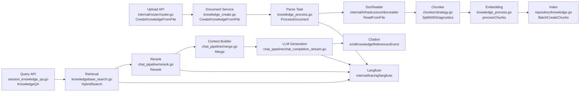
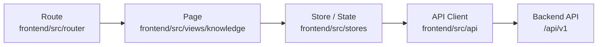
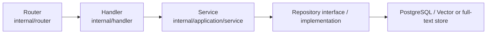

# WeKnora RAG 评测与 Chunking 自修复课题：代码库地图

> 调查对象：`D:\WeKnora`；分支：`main`；Commit：`7b2c9e73bf6950edde8165e4fe352714b7e5c16e`  
> 调查方式：只读源码、配置、迁移、测试与前端交叉检索。用户指定的 `$source-driven-development`、`$context-engineering` Skill 在当前环境不可用，因此未虚构调用；本文以“已验证 / 推断 / 未验证”明确证据等级。未进行功能设计或业务代码修改。

## 1. 结论摘要

- WeKnora 已有完整 RAG 主链、可配置 Chunking、Asynq 任务、混合检索/Rerank、引用事件及 Langfuse Trace/Span/Generation。
- 已有 `evaluation` API 和内存评测任务，可计算 Precision、Recall、NDCG、MRR、MAP、BLEU、ROUGE；但没有持久化评测领域、Testset 工作流、LLM-as-a-judge、Score 写入、调度回归和前端仪表盘。
- 已有按 Chunk 生成问题的能力，但产物只是 Chunk metadata 与问题索引，不是带参考答案、证据、审核和版本的 Q&A Testset。
- Chunking 配置支持 `auto`、`heading`、`heuristic`、`recursive`、`legacy`；文档级覆盖知识库级。知识库配置修改不会自动重解析。
- 发现两个需后续确认的现状：迁移/配置的 overlap 默认值 `50` 与后端/新前端回退值 `80` 不一致；前端调用的 `/knowledge-bases/:kbId/rebuild-index` 未找到对应后端路由。

## 2. RAG 完整调用链

| 阶段 | API/入口 | Handler/Service | Repository/模型/任务 | 下游 |
|---|---|---|---|---|
| 上传与记录 | `internal/router/router.go` | `internal/handler/knowledge.go` / `CreateKnowledgeFromFile`；`internal/application/service/knowledge_create.go` | `types.Knowledge`；Knowledge repository；Asynq | `ProcessDocument` |
| 解析 | 异步消费入口 | `internal/application/service/knowledge_process.go` / `ProcessDocument` | processing span、任务状态 | DocReader、Chunker |
| Chunking | 解析任务内部 | `chunker.SplitWithDiagnostics` | `types.ChunkingConfig`、诊断信息 | Embedding/索引 |
| Embedding/索引 | `processChunks` | model service + repository | `types.Chunk`、向量/全文索引 | 可检索 Chunk |
| Query | 会话问答路由 | `KnowledgeQA`、`KnowledgeQAByEvent` | session/message types | pipeline |
| 检索 | pipeline search | `knowledgebase_search.go` / `HybridSearch` | Knowledge/Chunk repository | Rerank |
| Rerank/上下文 | pipeline | `rerank.go`、`merge.go`、`into_chat_message.go` | retrieval items/messages | LLM |
| 生成/引用 | SSE/event | `chat_completion_stream.go`；`emitKnowledgeReferencesEvent` | answer event/reference | 客户端/Langfuse |

### 2.1 上传、记录与任务

文件路径：`internal/handler/knowledge.go`、`internal/application/service/knowledge_create.go`、`internal/application/service/knowledge_process.go`  
关键函数、类型、接口、表或组件：`CreateKnowledgeFromFile`、`ProcessDocument`、`types.Knowledge`  
当前职责：接收文件、创建知识记录并提交解析任务；任务调用 DocReader、分块、Embedding 和索引。  
调用上游：`internal/router/router.go` 注册的知识库 API。  
调用下游：DocReader、`SplitWithDiagnostics`、`processChunks`、Knowledge/Chunk repository。  
关键输入：tenant、knowledge base、文件、解析和 Chunking 配置。  
关键输出：知识记录、异步任务、Chunk 与索引。  
与本项目的关系：Testset 生成与候选策略重解析必须关联真实文档生命周期。  
推荐复用或扩展方式：复用现有任务和状态入口；本轮不设计新类型。  
仍需验证的问题：不同解析失败分支是否都能把知识状态落为 failed；运行基线已观察到一个未落失败的分支。  
证据等级：已验证。

### 2.2 检索、生成与引用

文件路径：`internal/application/service/session_knowledge_qa.go`、`internal/application/service/knowledgebase_search.go`、`internal/application/service/chat_pipeline/search.go`、`internal/application/service/chat_pipeline/rerank.go`、`internal/application/service/chat_pipeline/merge.go`、`internal/application/service/chat_pipeline/chat_completion_stream.go`  
关键函数、类型、接口、表或组件：`KnowledgeQA`、`HybridSearch`、`Rerank`、`Merge`、`emitKnowledgeReferencesEvent`  
当前职责：执行混合召回、重排、上下文拼接、流式回答和引用事件。  
调用上游：会话问答 Handler/API。  
调用下游：Chunk repository、Embedding/Rerank/Chat 模型、Langfuse。  
关键输入：query、知识库范围、Top-K、模型与会话上下文。  
关键输出：排序 Chunk、上下文、生成 token、回答和引用。  
与本项目的关系：可作为真实评测执行器和单题证据来源。  
推荐复用或扩展方式：复用同一 pipeline，避免另建一套检索/生成实现。  
仍需验证的问题：运行时相似度、rerank 分数和引用字段能否稳定关联到单题评测记录。  
证据等级：已验证（源码）；运行关联未验证。

## 3. Chunking 配置体系

文件路径：`internal/infrastructure/chunker/strategy.go`、`internal/infrastructure/chunker/splitter.go`、`internal/application/service/knowledge_process_config.go`、`internal/types/knowledgebase.go`、`frontend/src/views/knowledge/settings/KBChunkingSettings.vue`、`frontend/src/views/knowledge/settings/KBChunkingDebug.vue`  
关键函数、类型、接口、表或组件：`SplitWithDiagnostics`、`resolveChainWithProfile`、`ResolveProcessConfig`、`mergeChunkingConfig`、`ChunkingConfig`  
当前职责：解析文档级/知识库级配置并选择策略；支持实时配置/预览 UI。  
调用上游：文档解析、知识库设置和预览入口。  
调用下游：heading、heuristic、legacy splitter；Embedding/index。  
关键输入：strategy、chunk size、overlap、separators、父子分块和文档画像。  
关键输出：Chunk、实际策略和回退诊断。  
与本项目的关系：候选策略实验和推荐必须复用同一解析器及诊断结果。  
推荐复用或扩展方式：直接复用策略链和 preview，不复制算法。  
仍需验证的问题：迁移/配置 overlap `50` 与 `splitter.go` 及新 UI 回退 `80` 的实际优先级；运行实例的最终值需按配置读取。  
证据等级：已验证。

策略事实：

- `auto` 根据画像选择并允许回退；`heading`、`heuristic` 均可回退到 `legacy`。
- `recursive` 当前作为 legacy 别名；空策略落到 legacy；未知策略落到 auto。
- 文档级配置覆盖知识库级；其后才是代码回退值。
- 父子分块、分隔符、size/overlap 均在 `ChunkingConfig`/前端设置中出现。
- `internal/types/indexing_strategy.go` 的 `NeedsEmbedding()` 对 vector 或 keyword 都返回 true；“纯关键词索引无需 Embedding”不符合当前源码。

## 4. 配置修改后的重新解析与索引

文件路径：`internal/handler/knowledge.go`、`internal/router/router.go`、`internal/application/service/knowledge_process.go`、`frontend/src/api/knowledge-base/index.ts`  
关键函数、类型、接口、表或组件：`ReparseKnowledge`、`BatchReparseKnowledge`、`CancelKnowledgeParse`、前端 `rebuildKBIndex`  
当前职责：提供单文档/批量重解析和取消；解析任务重建 Chunk/Embedding/索引并更新状态。  
调用上游：知识管理 API/前端操作。  
调用下游：旧 Chunk 清理、Asynq、`ProcessDocument`。  
关键输入：knowledge ID、解析配置。  
关键输出：任务 ID、处理状态、重建索引。  
与本项目的关系：用户确认策略后应复用此生命周期。  
推荐复用或扩展方式：沿现有 reparse/cancel/status 能力扩展可观察性。  
仍需验证的问题：知识库配置保存后不会自动触发重解析；前端 `/knowledge-bases/:kbId/rebuild-index` 在当前后端路由未找到匹配；失败重试 UI 未完整确认。  
证据等级：已验证；接口不匹配为已验证的源码检索结果。

## 5. 已有评测能力

文件路径：`internal/handler/evaluation.go`、`internal/application/service/evaluation.go`、`internal/application/service/metric_hook.go`、`internal/application/service/metric/precision.go`、`internal/application/service/metric/recall.go`、`internal/application/service/metric/mrr.go`、`internal/application/service/metric/bleu.go`、`internal/application/service/metric/rouge.go`、`internal/router/router.go`  
关键函数、类型、接口、表或组件：`POST /api/v1/evaluation`、`GET /api/v1/evaluation?task_id=...`、`evaluationMemoryStorage`、Precision、Recall、NDCG、MRR、MAP、BLEU、ROUGE  
当前职责：从默认/指定 Parquet 数据集启动真实 RAG 评测，以内存任务返回聚合指标。  
调用上游：Evaluation Handler。  
调用下游：现有检索和问答 pipeline。  
关键输入：dataset、知识库和运行配置。  
关键输出：任务状态、检索及回答指标。  
与本项目的关系：可直接扩展 Evaluator 与执行器，但不足以承载生产评测治理。  
推荐复用或扩展方式：复用指标实现和真实 pipeline；持久化、单题结果、实验与调度属后续缺口。  
仍需验证的问题：默认远程 Parquet 在当前网络/凭据下可用性未验证。  
证据等级：已验证（源码和测试）。

当前明确不支持：持久历史、批次/实验对比、取消、可靠重试、定时调度、LLM-as-a-judge、Langfuse Score、前端 Evaluation 页面。任务当前由裸 goroutine 和进程内 `evaluationMemoryStorage` 管理。

文件路径：`internal/application/service/knowledge_process.go`、生成问题相关类型/测试  
关键函数、类型、接口、表或组件：`ProcessQuestionGeneration`、`GeneratedQuestion`  
当前职责：为 Chunk 生成问题并写入 Chunk metadata/问题索引。  
调用上游：文档处理任务。  
调用下游：LLM、Chunk repository/index。  
关键输入：Chunk 内容。  
关键输出：问题文本及其 Chunk 关联。  
与本项目的关系：可作为 Testset 问题生成种子。  
推荐复用或扩展方式：复用问题生成，不把它误称为完整 Testset。  
仍需验证的问题：当前无参考答案、证据快照、难度、审核、版本模型。  
证据等级：已验证。

## 6. Langfuse 接入

文件路径：`internal/tracing/langfuse/client.go`、`internal/tracing/langfuse/tracer.go`、`internal/tracing/langfuse/events.go`、`internal/tracing/langfuse/retrieval_obs.go`、`internal/application/service/chat_pipeline/search.go`、`internal/application/service/chat_pipeline/rerank.go`  
关键函数、类型、接口、表或组件：Trace、Span、Generation 创建/结束方法及 tracing metadata  
当前职责：记录请求 trace、检索/rerank span、LLM generation、input/output、model、token、latency 和 error。  
调用上游：文档处理及 RAG pipeline。  
调用下游：Langfuse HTTP client。  
关键输入：trace/session/user metadata、检索摘要、prompt/model、生成输出。  
关键输出：Langfuse 可观测记录。  
与本项目的关系：可复用为评测运行关联和仪表盘跳转数据源。  
推荐复用或扩展方式：复用现有 trace 传播；后续才考虑 Score 写入/读取。  
仍需验证的问题：当前仓库未找到 Score writer/read client；引用未作为独立 Langfuse 对象写入；前端未找到 Trace 跳转；运行环境未配置 Langfuse。  
证据等级：已验证（源码）；运行 Trace 未验证。

## 7. 异步任务与定时任务

文件路径：`internal/router/task.go`、`internal/router/task_inspector.go`、`internal/application/repository/task_queue.go`、`internal/types/task.go`、`internal/types/task_dead_letter.go`、`internal/datasource/scheduler.go`、`internal/application/service/knowledge_housekeeping.go`  
关键函数、类型、接口、表或组件：Asynq server、queue、inspector、dead-letter types、datasource `Scheduler`、housekeeping cron、task status  
当前职责：承载文档解析等后台任务，提供队列、重试、失败归档/检查、并发与定时入口。  
调用上游：Knowledge service 和服务启动。  
调用下游：Redis、worker handler、repository。  
关键输入：task type、payload、重试/超时选项。  
关键输出：task state、执行结果和失败信息。  
与本项目的关系：Testset、批量评测、定时回归、候选策略和大规模重解析可沿用框架能力。  
推荐复用或扩展方式：复用 Asynq，不继续采用 evaluation 的裸 goroutine。  
仍需验证的问题：各现有任务的取消、幂等键、重启恢复及死信补偿覆盖程度不完全一致。  
证据等级：已验证（框架存在）；逐任务保证未验证。

## 8. Vue 前端结构

文件路径：`frontend/src/router/index.ts`、`frontend/src/views/knowledge/KnowledgeBase.vue`、`frontend/src/views/knowledge/KnowledgeBaseEditorModal.vue`、`frontend/src/views/knowledge/settings/KBChunkingSettings.vue`、`frontend/src/api/knowledge-base/index.ts`、`frontend/src/stores/*`、`frontend/src/utils/request.ts`  
关键函数、类型、接口、表或组件：知识库路由、设置页、文档页、Chunk preview、API client、Pinia stores  
当前职责：路由/页面、认证请求、错误处理、知识库配置、文档状态与 Chunk 预览。  
调用上游：浏览器用户操作。  
调用下游：Axios/request 封装和后端 API。  
关键输入：tenant/KB/document/session 状态及筛选分页参数。  
关键输出：设置、列表、进度、预览和问答 UI。  
与本项目的关系：未来评测入口最接近知识库级页面/设置，但本轮不做页面设计。  
推荐复用或扩展方式：沿现有 route→page→store/API 组织；复用表格、分页、状态提示。  
仍需验证的问题：当前未找到 Evaluation route/API/store/dashboard、通用图表库或 Trace 跳转组件。  
证据等级：已验证。

## 9. 后端组织方式

文件路径：`internal/types/*`、`internal/repository/*`、`internal/application/service/*`、`internal/handler/*`、`internal/router/router.go`、`migrations/*`  
关键函数、类型、接口、表或组件：domain types、repository interfaces、service interfaces/implementations、handlers、Dig DI、numbered migrations  
当前职责：分层组织领域类型、持久化、业务编排、HTTP 和依赖注入。  
调用上游：HTTP/worker。  
调用下游：PostgreSQL、Redis、模型和外部服务。  
关键输入：DTO/domain/filter/page/order。  
关键输出：domain objects、分页响应、错误。  
与本项目的关系：后续新增能力应遵守现有依赖方向；这里只记录现状。  
推荐复用或扩展方式：类型/接口→repository→service→handler→router，并新增连续编号迁移。  
仍需验证的问题：最新迁移至 `000069`；正式新增时需重新确认主线最新编号。事务、过滤和排序应按相邻领域实现选型。  
证据等级：已验证。

## 10. 权限、隔离和审计

文件路径：`internal/middleware/*`、tenant/user/knowledge-base service 与 repository、审计相关 types/repository/service、`migrations/*`  
关键函数、类型、接口、表或组件：tenant context、RBAC/permission middleware、knowledge base access checks、audit log  
当前职责：用户/租户/资源访问控制、repository 数据过滤与部分操作审计。  
调用上游：受保护 API。  
调用下游：service/repository。  
关键输入：用户、tenant、role、resource ID。  
关键输出：授权结果和隔离后的数据。  
与本项目的关系：未来评测数据必须继承 tenant、KB 资源边界。  
推荐复用或扩展方式：沿既有 middleware 与 tenant-scoped repository；本轮不形成正式设计。  
仍需验证的问题：未找到评测审计、Chunking 配置版本、数据版本和完整并发更新控制；现有审计 action 覆盖需逐项确认。  
证据等级：已验证。

## 11. 可复用、应扩展与真实缺口

### 可以直接复用

- 真实 RAG pipeline、检索/重排/生成/引用链。
- Chunking 策略、诊断与预览，文档重解析/取消入口。
- Asynq/Redis worker 与 scheduler 基础设施。
- 现有检索/回答指标实现及 per-chunk 问题生成。
- Langfuse Trace/Span/Generation 基础封装。
- tenant/RBAC/知识库隔离及前后端通用组织方式。

### 应当扩展

- `evaluation` 的 Evaluator、任务生命周期、结果持久化和单题明细。
- 生成问题能力，补足答案、证据、难度、审核和版本。
- Langfuse 关联数据和 Score；知识库 UI 增加真实 Evaluation 模块。
- 现有 Asynq task 类型承载批量/定时/候选策略实验。

### 真实缺口

- 生产级 Testset 领域与人工审核。
- Context Precision/Recall 和 Faithfulness/Relevance/Correctness 的 judge 实现与 Prompt 版本。
- 实验、配置版本、历史趋势、失败分析和策略推荐闭环。
- Evaluation dashboard/API/store、评测审计、Langfuse Score 读写。

### 应避免重复实现

- 不另写检索/生成链、Chunker、任务队列、租户权限、Trace SDK 或已有 IR/NLG 指标。

## 12. 最终需求映射表

| 题目需求 | 当前现有能力 | 源码证据 | 可直接复用 | 应扩展位置 | 真实缺口 | 风险或未验证项 |
|---|---|---|---|---|---|---|
| 1. Q&A Testset 自动生成 | Chunk 问题生成 | `knowledge_process.go` / `ProcessQuestionGeneration` | 问题种子 | evaluation/service | 答案、证据、数据集 | 质量未运行验证 |
| 2. 高难度问题生成 | 未找到难度控制 | 同上 | LLM 调用 | prompt/evaluator | 难度标签/策略 | 未验证 |
| 3. 参考答案与证据保存 | 引用和 Chunk 存在 | `session_knowledge_qa.go` | Chunk/引用结构 | evaluation repository | 快照与版本 | 引用粒度 |
| 4. 人工审核 Testset | 当前未找到 | 前端/后端全库检索 | 权限/表格 | 新评测页面/API | 审核流 | 未验证 |
| 5. Context Precision | 有一般 Precision | `metric/precision.go` | 指标框架 | evaluator | RAGAS 语义定义 | 定义需固定 |
| 6. Context Recall | 有一般 Recall | `metric/recall.go` | 指标框架 | evaluator | 参考证据召回 | 需 gold evidence |
| 7. Hit Rate@K | 可由排名结果计算 | evaluation/search | 排名结果 | metrics | 显式指标 | K 定义 |
| 8. MRR | 已有 | `metric/mrr.go` | 是 | 展示/持久化 | 无 | 运行未验证 |
| 9. Answer Faithfulness | 未找到 | 仅 BLEU/ROUGE | generation/context | judge evaluator | LLM judge | 模型凭据 |
| 10. Answer Relevance | 未找到 | 同上 | pipeline output | judge evaluator | LLM judge | prompt 偏差 |
| 11. Answer Correctness | BLEU/ROUGE 近似 | `metric/bleu.go`、`metric/rouge.go` | 基础指标 | evaluator | judge/语义正确性 | reference quality |
| 12. LLM-as-a-judge | 未找到 | 全库检索 | 模型接口 | evaluation service | judge 编排 | 成本/稳定性 |
| 13. Judge Prompt 版本 | 未找到 | 全库检索 | 通用配置 | prompt/version persistence | 版本追踪 | 未验证 |
| 14. Langfuse 数据复用 | Trace/Span/Generation | `internal/tracing/langfuse/*` | 是 | trace association | Score 读写 | 运行未配置 |
| 15. 自动化批量评测 | 内存 evaluation task | `evaluation.go` | pipeline/metrics | Asynq task | 可靠批次 | 裸 goroutine |
| 16. 定时评测 | Asynq scheduler 基础 | task infrastructure | scheduler | evaluation task | 计划配置 | 未运行验证 |
| 17. 任务进度 | 文档任务/评测状态 | task/evaluation services | 状态范式 | persisted evaluation task | 细粒度进度 | 进程重启 |
| 18. 失败重试 | Asynq 支持 | task infrastructure | 是 | evaluation task | judge 分类重试 | 幂等需验证 |
| 19. 评测仪表盘 | 未找到 | frontend 全库检索 | 通用 UI | KB route/page/API/store | 图表/趋势页 | 无图表库 |
| 20. 单题失败分析 | 未持久化单题 | evaluation 聚合结果 | pipeline trace | result detail | 归因模型 | 数据关联 |
| 21. Chunking 候选策略 | 多策略已有 | `chunker/strategy.go` | 是 | experiment runner | 候选生成规则 | auto 回退影响 |
| 22. 候选策略对照实验 | 未找到 | 全库检索 | reparse/evaluation | task/service | 隔离实验 | 重建成本 |
| 23. 分块策略推荐 | auto 选择非评测推荐 | `resolveChainWithProfile` | 诊断 | evaluator→recommendation | 低分归因 | 不应混同 auto |
| 24. 用户确认后重新解析 | reparse/cancel API | `knowledge.go` | 是 | UI workflow | 确认/预估 | KB rebuild 路由疑点 |
| 25. 实验版本追踪 | 未找到 | 全库检索 | 通用 IDs | persistence | experiment version | 未验证 |
| 26. Chunking 配置版本追踪 | 仅当前配置 | config/types/migrations | 配置模型 | audit/version | 历史与 diff | 默认值冲突 |
| 27. 权限与空间隔离 | tenant/RBAC/KB access | middleware/services | 是 | evaluation repository/API | 评测资源授权 | 逐接口验证 |
| 28. 审计日志 | 已有部分审计 | audit 相关代码 | 基础设施 | action types | 评测/配置审计 | 覆盖不完整 |

## 13. 调查边界

本文没有把 README 声称视为运行事实。源码存在、官方文档声明、合理推断和运行验证均保持分离；实际运行结果以同 Commit 的 `BASELINE_REPORT.md` 为准。
