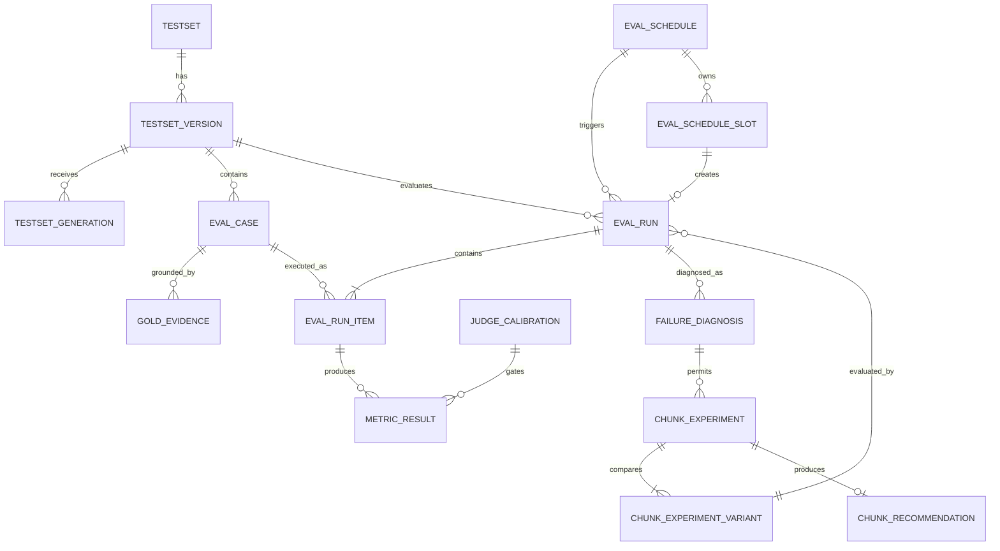

# WeKnora RAG 评测逻辑数据模型

## 1. 目的与边界

本文定义 RAG 评测、定时执行和 Chunking 候选推荐所需的逻辑数据模型。它不是数据库迁移文件，不规定具体 SQL 方言、GORM 标签或物理表名。

模型遵循以下原则：

- WeKnora 数据库保存权威业务状态和评测结果。
- 所有业务实体都属于 tenant，并通过 knowledge base 继承访问边界。
- 发布的测试集和已创建运行使用不可变快照，确保可复现。
- Gold Evidence 绑定文档原文位置和内容哈希，而不是只绑定临时 Chunk ID。
- MVP 的 ChunkExperiment 只保存临时实验及只读推荐；确认、应用、重解析和回滚模型仅在非 MVP 增强节中占位，并标记 **Pending Verification**。

## 2. 通用约定

### 2.1 标识与时间

- `id`：字符串 UUID，与仓库现有字符串资源 ID 风格保持一致。
- 时间：统一存储 UTC，API 使用 RFC 3339；Schedule 另存 IANA 时区用于 cron 求值。
- `created_at/updated_at`：所有可变实体必备。
- `created_by/updated_by`：保存用户或 API Key principal ID。
- 软删除资源使用 `archived_at/archived_by`，不立即物理删除仍被历史运行引用的行。

### 2.2 多租户字段

除纯子实体外，顶层资源必须保存：

| 字段 | 含义 |
| --- | --- |
| `tenant_id` | 权限和数据隔离主边界 |
| `knowledge_base_id` | 资源所属知识库 |
| `created_by` | 创建 principal |
| `created_at` | 创建时间 |
| `updated_at` | 最后更新时间 |

子实体通过父级继承 tenant/KB，但 Repository 查询仍必须联结或同时过滤父级边界，不能只凭客户端提交的父 ID。

### 2.3 JSON 快照

快照字段保存规范化 JSON，并同时保存 SHA-256 哈希。规范化要求对象键排序、忽略展示字段、数字采用确定性格式。相同有效配置应产生相同哈希。

所有 source locator 必须显式保存 `offset_unit` 和 `source_normalization_version`。只有 source/execution identity mapping 能证明相同 source document/hash/normalization 时，execution 结果才可参与 Gold Evidence 匹配。

### 2.4 evaluation_data_policy 快照

不新增通用 DLP 实体。TestsetVersion、EvalSchedule、EvalRun 与 ChunkExperiment 以规范化 JSON 保存 `evaluation_data_policy` 及 version/hash，至少表达：是否允许外部 Judge；Langfuse 对 Question、Retrieved Context、Answer 分别使用 full/redacted/hash_or_metadata_only 哪种模式；是否允许第三方模型接收敏感文档片段。

真实 KB 敏感级别到策略的映射为 **Pending Verification**。在此之前，受限 KB 的安全默认值为：禁止外部 Judge；Langfuse 的 Question/Answer 仅发送脱敏值或 hash，Context 仅记录 correlation/source ID、hash、rank、长度和脱敏摘要；内部 DB 仅保存业务所需最小结果；没有合规私有 Judge 时 Judge Metric 为 invalid/blocked，不能伪造分数。

## 3. 关系概览



## 4. Testset

测试集是稳定的产品容器，具体内容位于 Version。

| 字段 | 类型 | 必填 | 说明 |
| --- | --- | --- | --- |
| `id` | string | 是 | Testset ID |
| `tenant_id` | uint/string | 是 | 沿用现有 tenant ID 类型 |
| `knowledge_base_id` | string | 是 | 所属知识库 |
| `name` | string | 是 | 同一 KB 内便于识别的名称 |
| `description` | string | 否 | 测试集目的和文档范围说明 |
| `status` | enum | 是 | `active/archived` |
| `current_published_version_id` | string | 否 | 当前发布版本 |
| `created_by` | string | 是 | 创建 principal |
| `created_at` | timestamp | 是 | 创建时间 |
| `updated_at` | timestamp | 是 | 更新时间 |
| `archived_at` | timestamp | 否 | 归档时间 |

约束：

- `name` 在同一 `tenant_id + knowledge_base_id` 的 active Testset 中唯一。
- 被 Run 引用的 Testset 只能归档，不能级联删除历史数据。

## 5. TestsetVersion

| 字段 | 类型 | 必填 | 说明 |
| --- | --- | --- | --- |
| `id` | string | 是 | Version ID |
| `testset_id` | string | 是 | 父 Testset |
| `version_number` | int | 是 | 从 1 递增 |
| `status` | enum | 是 | `draft/published/archived` |
| `base_version_id` | string | 否 | 从哪个发布版本克隆 |
| `document_snapshots` | JSON array | 条件 | 空 draft 且 Profile 未锁定时可空；锁定后及发布时必填 |
| `document_snapshot_hash` | string | 条件 | 空 draft 可空；锁定后及发布时必填 |
| `source_normalization_version` | string | 条件 | 空 draft 可空；锁定后及发布时必填 |
| `offset_unit` | string | 条件 | 空 draft 可空；锁定后及发布时必填，具体支持值需原型确认 |
| `split_algorithm` | string | 条件 | 空 draft 可空；锁定后及发布时必填并版本化 |
| `split_seed` | string/int | 条件 | 空 draft 可空；锁定后及发布时必填 |
| `generator_model_id` | string | 条件 | 锁定 Profile 的一致配置摘要；空 draft 可空，不覆盖 Generation provenance |
| `generator_model_name` | string | 条件 | 锁定 Profile 的运行时模型摘要；具体事实以 Generation/Case 为准 |
| `generator_prompt_version` | string | 条件 | 锁定 Profile 摘要；空 draft 可空 |
| `generator_prompt_hash` | string | 条件 | 锁定 Profile 摘要；空 draft 可空 |
| `generation_profile_status` | enum | 是 | `unlocked/locked`；新空 draft 为 unlocked |
| `generation_profile_hash` | string | 条件 | locked/published 时必填，规范化 Profile 哈希 |
| `generation_profile_generation_id` | string | 条件 | 首个成功接纳并锁定 Profile 的 Generation |
| `generation_profile_locked_at` | timestamp | 条件 | Profile 原子锁定时间 |
| `evaluation_data_policy` | JSON | 条件 | locked/published 时必填的策略快照 |
| `evaluation_data_policy_hash` | string | 条件 | 策略快照哈希 |
| `case_count` | int | 是 | 全部 Case 数 |
| `enabled_case_count` | int | 是 | 启用 Case 数 |
| `approved_case_count` | int | 是 | 已审核 Case 数 |
| `created_by` | string | 是 | 创建者 |
| `published_by` | string | 否 | 发布者 |
| `published_at` | timestamp | 否 | 发布时间 |
| `archived_at` | timestamp | 否 | 归档时间 |
| `created_at/updated_at` | timestamp | 是 | 审计时间 |

每个 `document_snapshots[]` 至少包含：

```json
{
  "source_document_id": "knowledge-id",
  "title": "document title",
  "source": "file",
  "document_type": "markdown",
  "file_hash": "sha256-or-existing-file-hash",
  "content_hash": "normalized-source-content-hash",
  "source_normalization_version": "pending-prototype",
  "offset_unit": "pending-prototype",
  "normalized_source_length": 12345,
  "parse_completed_at": "2026-07-16T02:00:00Z"
}
```

`offset_unit` 与 `source_normalization_version` 的实际取值、Markdown/PDF/DOCX/HTML 等类型的稳定回查能力目前没有运行原型证据，均为 **Pending Verification**。MVP 只能启用已通过定位原型的文档类型；未通过类型可以显示但不能进入 published Version。

约束：

- 唯一键：`testset_id + version_number`。
- 新建空 draft 时 `generation_profile_status=unlocked`，文档范围、normalization/offset、split、generator 摘要和数据策略字段允许为空。
- 第一次合法 TestsetGeneration 被 API 成功接纳并持久化时，必须在同一事务内把完整 Generation Profile 写入 Version 并切换为 locked；并发的第一个请求只能有一个成功锁定者。
- locked draft 的后续 Generation Profile 必须与 `generation_profile_hash` 完全一致；不一致为冲突，不得合并、覆盖或解锁。Generation 后续 failed/canceled 不解除锁定。
- `published` 要求 Profile/data policy/文档快照字段全部非空，且至少有一个 enabled + approved + non-stale Case；answerable Case 必须有 Gold Evidence，unanswerable Case 必须没有 Gold Evidence。
- `published` 后业务字段不可更新，只允许随 Testset 整体归档；MVP 不提供独立 Version archive/restore API。
- Testset 同时只能有一个当前发布版本；发布新版本时只更新 Testset 指针，不修改旧版本。
- Case 与 TestsetGeneration 是具体 provenance 的事实源；Version 级 generator 字段只能作为一致配置摘要。

## 6. EvalCase

| 字段 | 类型 | 必填 | 说明 |
| --- | --- | --- | --- |
| `id` | string | 是 | Case ID |
| `testset_version_id` | string | 是 | 所属草稿/发布版本 |
| `question` | text | 是 | 测试问题 |
| `answerability` | enum | 是 | `answerable/unanswerable` |
| `reference_answer` | text | 条件 | answerable 时的证据型参考答案 |
| `reference_key_points` | JSON array | 条件 | answerable 时用于 Correctness 的关键事实 |
| `expected_refusal` | text | 条件 | unanswerable 时的期望拒答原则，不提供虚构答案 |
| `unanswerable_reason_code` | string | 条件 | 无答案原因稳定码 |
| `unanswerable_reason` | text | 条件 | 无答案原因的简短、可审核说明 |
| `checked_scope` | JSON | 条件 | 无答案题检查过的 source document/section/query 范围 |
| `question_type` | enum | 是 | `single_evidence/multi_evidence/unanswerable` |
| `difficulty` | enum | 是 | `easy/medium/hard` |
| `split` | enum | 是 | `tuning/holdout` |
| `review_status` | enum | 是 | `pending/approved/rejected` |
| `review_comment` | text | 否 | 审核意见 |
| `enabled` | bool | 是 | 是否进入发布和运行 |
| `stale` | bool | 是 | 证据是否因文档变化失效 |
| `quality_gate_status` | enum | 是 | `pending/passed/failed` |
| `quality_check_version` | string | 是 | 质量门禁规则/Prompt 版本 |
| `quality_checks` | JSON | 是 | schema/duplicate/leakage/ambiguity/support 结果与 reason codes |
| `generator_model_id` | string | 否 | 该 Case 的生成模型 |
| `generator_prompt_version` | string | 否 | 该 Case 的 Prompt 版本 |
| `generator_prompt_hash` | string | 否 | Prompt 哈希 |
| `generation_id` | string | 否 | 来源生成任务 ID |
| `created_by/reviewed_by` | string | 否 | 创建与审核 principal |
| `reviewed_at` | timestamp | 否 | 审核时间 |
| `created_at/updated_at` | timestamp | 是 | 审计时间 |

约束：

- published Version 下的 Case 不可编辑、删除或改变 enabled。
- `multi_evidence` 至少有两条 GoldEvidence。
- answerable + approved 要求参考答案、key points 和至少一条有效 GoldEvidence。
- unanswerable + approved 要求 `checked_scope`、`unanswerable_reason_code`、expected refusal，且 GoldEvidence 集合为空。
- exact duplicate 自动失败；near duplicate 在阈值原型完成前只标记候选并要求人工确认。near-duplicate 阈值为 **Pending Verification**。
- 质量门禁必须保存 Schema、重复、答案泄漏、歧义和 claim-evidence support 的逐项状态；任何 failed 阻止发布。
- stale Case 不能被发布，也不能进入新 EvalRun。

## 7. GoldEvidence

| 字段 | 类型 | 必填 | 说明 |
| --- | --- | --- | --- |
| `id` | string | 是 | Evidence ID |
| `eval_case_id` | string | 是 | 父 Case |
| `source_document_id` | string | 是 | 原始 Knowledge ID |
| `document_file_hash` | string | 是 | 文档文件哈希快照 |
| `document_content_hash` | string | 是 | 规范化内容哈希 |
| `source_normalization_version` | string | 是 | 与文档快照完全一致 |
| `offset_unit` | string | 是 | 与文档快照完全一致 |
| `start_at` | int64 | 是 | 原文闭开区间起点 |
| `end_at` | int64 | 是 | 原文闭开区间终点 |
| `text_snapshot` | text | 是 | 证据文本快照 |
| `content_hash` | string | 是 | Evidence 文本哈希 |
| `source_locator` | JSON | 否 | 页码、标题路径等展示定位 |
| `generation_chunk_id` | string | 否 | 生成时 Chunk ID，仅辅助排查 |
| `ordinal` | int | 是 | 在 Case 内顺序 |
| `created_at` | timestamp | 是 | 创建时间 |

约束：

- 使用闭开区间 `[start_at,end_at)`。
- `start_at >= 0` 且 `end_at > start_at`。
- 发布前必须能根据相同文档内容重算 `text_snapshot` 和 `content_hash`。
- Metric 匹配键固定为 `source_document_id + document_content_hash + source_normalization_version + offset_unit + interval`。
- 同一 Case 内 `ordinal` 唯一。

## 8. TestsetGeneration

TestsetGeneration 是异步生成任务的轻量状态资源，服务于 `/generations` API。

| 字段 | 类型 | 必填 | 说明 |
| --- | --- | --- | --- |
| `id` | string | 是 | Generation ID |
| `tenant_id/knowledge_base_id` | mixed/string | 是 | 隔离字段 |
| `testset_id/testset_version_id` | string | 是 | 目标草稿版本 |
| `document_ids` | string array | 是 | 选定文档 |
| `requested_case_count` | int | 是 | 请求样本数 |
| `status` | enum | 是 | `pending/running/completed/partial/failed/canceled` |
| `generated_case_count` | int | 是 | 成功写入数 |
| `rejected_case_count` | int | 是 | Schema/Evidence 校验失败数 |
| `quality_rejection_counts` | JSON | 是 | duplicate/leakage/ambiguity/support 等分类计数 |
| `model_snapshot/prompt_snapshot` | JSON | 是 | 生成配置 |
| `generation_profile` | JSON | 是 | 本次请求的文档/hash、normalization/offset、split、model/Prompt 完整快照 |
| `generation_profile_hash` | string | 是 | 与 Version lock 比较的规范化哈希 |
| `idempotency_key/request_hash` | string | 否 | HTTP 幂等信息 |
| `error_code/error_message` | string | 否 | 终态错误 |
| `created_by` | string | 是 | 发起 principal |
| `started_at/finished_at` | timestamp | 否 | 执行时间 |
| `cancel_requested_at/canceled_at` | timestamp | 否 | 显式取消状态 |
| `created_at/updated_at` | timestamp | 是 | 审计时间 |

## 9. EvalRun

| 字段 | 类型 | 必填 | 说明 |
| --- | --- | --- | --- |
| `id` | string | 是 | Run ID |
| `tenant_id` | mixed | 是 | Tenant |
| `knowledge_base_id` | string | 是 | 执行知识库；实验时为临时 KB |
| `source_knowledge_base_id` | string | 是 | 用户看到的源知识库 |
| `testset_id/testset_version_id` | string | 是 | 冻结测试集 |
| `trigger_type` | enum | 是 | MVP 为 `manual/schedule/experiment`；`legacy_api` 迁移非 MVP |
| `schedule_id` | string | 否 | 调度来源 |
| `experiment_variant_id` | string | 否 | 实验来源 |
| `parent_run_id` | string | 否 | 重试来源 |
| `retry_scope` | enum | 否 | 重试 Run 为 `failed/unfinished/all` |
| `retry_case_ids` | string array | 否 | 重试时精确冻结的 Case 集 |
| `schedule_slot_id` | string | 否 | Schedule Run 对应的唯一 Slot |
| `status` | enum | 是 | `pending/running/completed/partial/failed/canceled/blocked` |
| `stage` | enum | 否 | `preparing/retrieving/generating/judging/aggregating` |
| `snapshot` | JSON | 是 | 全部可复现配置 |
| `snapshot_hash` | string | 是 | 规范化快照哈希 |
| `evaluation_data_policy` | JSON | 是 | 创建时冻结的外部 Judge/Langfuse 数据发送策略 |
| `evaluation_data_policy_hash` | string | 是 | 策略快照哈希 |
| `metric_ks` | int array | 是 | 默认 `[5,10]` |
| `case_count` | int | 是 | 计划 Item 数 |
| `completed_count` | int | 是 | 成功执行数 |
| `failed_count` | int | 是 | 失败数 |
| `canceled_count` | int | 是 | 取消数 |
| `valid_metric_count` | int | 是 | 可聚合样本数 |
| `summary_metrics` | JSON | 否 | Run 聚合结果缓存 |
| `latency_ms/token_usage/cost` | JSON | 否 | 聚合资源数据 |
| `langfuse_session_id` | string | 否 | 固定使用 Run ID |
| `observability_status` | enum | 是 | `disabled/pending/sent/partial/failed` |
| `idempotency_key/request_hash` | string | 否 | HTTP 幂等信息 |
| `error_code/error_message/error_details` | mixed | 否 | Run 级错误 |
| `cancel_requested_at` | timestamp | 否 | 取消请求时间 |
| `created_by` | string | 是 | 发起 principal |
| `scheduled_at/started_at/finished_at` | timestamp | 否 | 生命周期时间 |
| `created_at/updated_at` | timestamp | 是 | 审计时间 |
| `raw_payload_expires_at` | timestamp | 是 | 目标 90 天，自动执行器非 MVP |
| `aggregate_expires_at` | timestamp | 是 | 目标 365 天，自动执行器非 MVP |

`snapshot` 必须包含：

- source document ID、file/content hash、normalization、offset unit，以及实验时的 source/execution identity mappings。
- TestsetVersion 与 Case ID 列表。
- 实际生效 Chunking 配置和哈希。
- Embedding、Rerank、生成、Judge 模型标识和关键参数：provider/model、temperature、top_p、max_tokens、seed（若支持）、embedding dimension、rerank threshold/top_n。
- Generator、真实 RAG answer、Judge Prompt 版本与哈希。
- 上下文构造版本、固定 `history_policy=no_history`、split algorithm/seed、Judge calibration version/status。
- 检索配置、指标 K、代码 commit/release。

约束：

- 终态 Run 不再更新业务结果，留存清理字段除外。
- Schedule 触发幂等由 `EvalScheduleSlot(schedule_id, scheduled_at_utc)` 唯一约束承载；EvalRun 不再是 skipped 时间槽的唯一事实源。
- 同一 tenant/operation 下 `idempotency_key` 与 `request_hash` 绑定。
- `case_count <= 100`。

## 10. EvalRunItem

| 字段 | 类型 | 必填 | 说明 |
| --- | --- | --- | --- |
| `id` | string | 是 | Item ID |
| `eval_run_id` | string | 是 | 父 Run |
| `eval_case_id` | string | 是 | Case |
| `attempt` | int | 是 | 本 Run 内执行尝试，起始 1 |
| `status` | enum | 是 | `pending/running/completed/failed/canceled` |
| `question_snapshot` | text | 是 | 问题快照 |
| `answerability_snapshot` | enum | 是 | `answerable/unanswerable` |
| `question_type_snapshot` | enum | 是 | 冻结题型 |
| `difficulty_snapshot` | enum | 是 | 冻结难度 |
| `reference_answer_snapshot` | text | 条件 | 仅 answerable 必填；unanswerable 必须为空 |
| `reference_key_points_snapshot` | JSON array | 条件 | 仅 answerable 适用 |
| `expected_refusal_snapshot` | text | 条件 | 仅 unanswerable 必填 |
| `unanswerable_reason_code_snapshot` | string | 条件 | 仅 unanswerable 必填 |
| `unanswerable_reason_snapshot` | text | 条件 | 仅 unanswerable 必填 |
| `checked_scope_snapshot` | JSON | 条件 | 仅 unanswerable 必填 |
| `gold_evidence_snapshot` | JSON | 条件 | answerable 非空；unanswerable 必须为空 |
| `document_identity_mappings` | JSON | 条件 | 实验 Run 的 source↔execution 映射 |
| `retrieved_contexts` | JSON | 否 | 排序召回结果及 source/execution 位置 |
| `generated_answer` | text | 否 | 实际答案 |
| `citations` | JSON | 否 | WeKnora 引用快照 |
| `latency_ms` | JSON | 否 | retrieval/rerank/generation/judge/total |
| `token_usage` | JSON | 否 | generation/judge 输入输出 Token |
| `cost` | JSON | 否 | 模型提供的可用成本 |
| `langfuse_trace_id` | string | 否 | Item Trace ID |
| `langfuse_trace_url` | string | 否 | 可可靠构造时保存/返回 |
| `error_code/error_message/error_details` | mixed | 否 | Item 错误 |
| `started_at/finished_at` | timestamp | 否 | 执行时间 |
| `created_at/updated_at` | timestamp | 是 | 审计时间 |

约束：

- 唯一键：`eval_run_id + eval_case_id + attempt`。
- answerable Item 必须有 reference answer、reference key points 和非空 Gold Evidence，expected refusal/unanswerable 字段必须为空。
- unanswerable Item 的 reference answer/key points/Gold Evidence 必须为空，expected refusal、reason code/reason 和 checked scope 必填。
- 快照必须足以在 EvalCase 不可访问、Testset 归档或原始载荷按策略到期前后复算适用指标；不得依赖运行时回读可变 Case。
- `retrieved_contexts[]` 必须保存 rank、`execution_chunk_id`、`execution_document_id`、`source_document_id`、source hash、normalization、offset unit、source start/end、score、match_type 和必要内容快照。
- mapping 缺失或 normalization/offset unit 不一致时，对应检索 MetricResult 必须 invalid，禁止退化为 execution ID 匹配。
- 完整原始字段到期清理后保留哈希、数量、状态和聚合指标。

## 11. MetricResult

| 字段 | 类型 | 必填 | 说明 |
| --- | --- | --- | --- |
| `id` | string | 是 | Metric ID |
| `eval_run_id` | string | 是 | 便于聚合和过滤 |
| `eval_run_item_id` | string | 是 | 父 Item |
| `metric_name` | string | 是 | 规则指标、`faithfulness/correctness/unanswerable_refusal_quality` 等 |
| `metric_family` | enum | 是 | `retrieval/generation/system` |
| `method` | enum | 是 | `rule/judge` |
| `value` | decimal | 否 | 0–1 或系统数值 |
| `execution_status` | enum | 是 | `completed/failed`；调用超时或服务失败为 failed，调用完成后的 Parser/Schema 失败为 completed+invalid |
| `status` | enum | 条件 | execution completed 时为 `valid/invalid/abstain`；failed 时为空 |
| `reason_code` | string | 否 | 稳定的 invalid/abstain/failed 原因码 |
| `reason` | text | 否 | 简短无效、弃权、失败或计算说明 |
| `metric_version` | string | 是 | 规则算法或 Judge Prompt 版本 |
| `details` | JSON | 否 | ranks、简短 claim verdict/reason、evidence ID；不保存无界长推理 |
| `model_snapshot` | JSON | 否 | Judge 模型和参数 |
| `prompt_hash` | string | 否 | Judge Prompt 哈希 |
| `parser_version` | string | 否 | Judge 结构化解析器版本 |
| `calibration_id/calibration_version` | string | 否 | Judge 上线门禁引用 |
| `calibration_status` | enum | 否 | `passed/failed/not_evaluated` |
| `judge_attempts` | JSON | 否 | 原始调用、格式修复、错误和 token/cost 摘要 |
| `error_code/error_message` | string | 否 | execution_status=failed 时必填 |
| `created_at` | timestamp | 是 | 创建时间 |

约束：

- 唯一键：`eval_run_item_id + metric_name + metric_version`。
- `execution_status=completed` 时才有 `status`；`valid` 必须有 value，`invalid/abstain` 的 value 必须为 null。
- `execution_status=failed` 时 value/status 均为空并保存 error；它不能伪装为 invalid 或合法 0。
- invalid/abstain/failed 均不参与均值分母。
- unanswerable Case 的五项 Gold-dependent retrieval metrics 必须是 `completed + abstain + value=null + NOT_APPLICABLE_UNANSWERABLE`；answerable Case 缺少 Gold/mapping 时为 invalid/null，不得记 0。

Judge 的每次执行信息并入 MetricResult；本模型不再定义独立 JudgeExecution。规则指标的 calibration 字段为空。未绑定 passed calibration 的 Judge Metric 可以展示，但不得进入 Recommendation。

## 12. JudgeCalibration

| 字段 | 类型 | 必填 | 说明 |
| --- | --- | --- | --- |
| `id` | string | 是 | Calibration ID |
| `tenant_id` | mixed | 是 | Tenant 范围 |
| `knowledge_base_id` | string | 是 | MVP 授权范围；复用目标 KB read/write access |
| `metric_name` | enum | 是 | `faithfulness/correctness/unanswerable_refusal_quality` |
| `calibration_version` | string | 是 | 上线门禁版本 |
| `model_snapshot` | JSON | 是 | Judge 模型关键参数 |
| `prompt_version/prompt_hash` | string | 是 | Prompt 身份 |
| `parser_version` | string | 是 | Parser 身份 |
| `human_annotation_version` | string | 是 | 人工标签版本 |
| `calibration_cases` | JSON | 是 | 至少 60 条、双人标签及分歧裁决引用 |
| `metrics` | JSON | 否 | Macro-F1、Exact Agreement、weighted kappa、三次重复稳定性、parser failure |
| `status` | enum | 是 | `draft/running/passed/failed`；MVP 不保留 archived |
| `created_by/created_at/updated_at` | mixed | 是 | 审计字段 |

MVP 只校准 Pointwise Judge，不定义 pairwise/swap 门槛。同一 Judge 模型、关键参数、Prompt、Parser 任一变化都必须创建新 calibration version。`draft/failed` 可进入 running；running 重复执行必须按幂等键返回同一执行或 409；passed 为终态。只有与 EvalRun 同一 knowledge base 且 `passed` 的 Calibration 可用于 Recommendation。

## 13. FailureDiagnosis

| 字段 | 类型 | 必填 | 说明 |
| --- | --- | --- | --- |
| `id` | string | 是 | Diagnosis ID |
| `tenant_id/knowledge_base_id` | mixed/string | 是 | 资源边界 |
| `eval_run_id` | string | 是 | 唯一来源 Run；Experiment 只绑定该单一 source Run |
| `scope` | JSON | 是 | document/document_type/case 集合 |
| `diagnosis_version` | string | 是 | 版本化诊断规则契约 |
| `diagnosis_status` | enum | 是 | `pending/running/completed/failed` |
| `label` | enum | 条件 | completed 时为 `chunking_likely/non_chunking_likely/unknown` |
| `reason_codes` | string array | 条件 | completed 时非空的稳定原因码 |
| `evidence_signals` | JSON | 条件 | 指标、错误、RunItem、Chunk 诊断和校准证据 |
| `target_k` | int | 是 | 诊断与后续 Recommendation 使用的明确 K |
| `eligible_case_count` | int | 是 | 可进入诊断的 Case 数 |
| `valid_case_count` | int | 是 | 实际有足够证据的 Case 数 |
| `generated_at` | timestamp | 否 | completed 时间 |
| `error_code/error_message` | string | 否 | failed 原因 |
| `retry_of_diagnosis_id` | string | 否 | failed 重试创建的新记录来源 |
| `created_at/updated_at` | timestamp | 是 | 审计时间 |

版本化决策顺序：

```text
测试题/Gold 是否有效
→ 文档是否解析和索引成功
→ 检索是否命中
→ Rerank 是否丢失 Gold
→ Retrieved Context 是否已充分
→ Generator 是否仍失败
→ 是否出现 Chunk 边界、尺寸、标题或冗余信号
→ 输出 label
```

MVP 稳定 reason codes：

- 非 Chunking/前置：`GOLD_EVIDENCE_INVALID`、`DOCUMENT_PARSE_INCOMPLETE`、`DOCUMENT_NOT_INDEXED`、`EMBEDDING_OR_SEARCH_FAILURE`、`RERANK_DROPPED_GOLD`、`CONTEXT_COMPLETE_GENERATION_FAILED`。
- Chunking：`CHUNK_BOUNDARY_SPLIT`、`CHUNK_TOO_LARGE_NOISY`、`CHUNK_TOO_SMALL_INCOMPLETE`、`HEADING_BODY_DETACHED`、`CROSS_EVIDENCE_NOT_CO_RETRIEVED`、`TOPK_REDUNDANCY_HIGH`。
- Unknown：`INSUFFICIENT_VALID_CASES`、`UNKNOWN_CAUSE`。

约束：

- blocked Run 只能 completed 为 `non_chunking_likely` 或 `unknown`，不得为 `chunking_likely`。
- 只有 `diagnosis_status=completed` 且 `label=chunking_likely` 的 Diagnosis 可被 Experiment 引用。
- failed Diagnosis retry 创建新记录，旧记录保持 failed；pending/running 重复创建按幂等键返回同一记录。
- Diagnosis reason 必须限制候选维度：`CHUNK_TOO_LARGE_NOISY` 只允许减小 size/结构化策略，`CHUNK_TOO_SMALL_INCOMPLETE` 只允许增大 size/父子上下文，`CHUNK_BOUNDARY_SPLIT` 只允许增加 overlap/size，`TOPK_REDUNDANCY_HIGH` 只允许降低 overlap，`HEADING_BODY_DETACHED` 只允许 heading strategy。其他 reason 不得生成通用网格。
## 14. EvalSchedule

| 字段 | 类型 | 必填 | 说明 |
| --- | --- | --- | --- |
| `id` | string | 是 | Schedule ID |
| `tenant_id/knowledge_base_id` | mixed/string | 是 | 所属范围 |
| `name` | string | 是 | 调度名称 |
| `testset_version_id` | string | 是 | 必须 published |
| `cron_expression` | string | 是 | 由现有 scheduler parser 校验；正式字段数/语法为 **Pending Verification** |
| `timezone` | string | 是 | IANA 时区，如 `Asia/Shanghai` |
| `enabled` | bool | 是 | 是否启用 |
| `status` | enum | 是 | `active/archived` |
| `sample_limit` | int | 是 | 每次最大 Case 数，MVP 1–100 |
| `metric_ks` | int array | 是 | 指标 K/top_k 的明确版本化配置 |
| `run_template` | JSON | 是 | 完整 Run 模板：Embedding/Rerank/answer/Judge 模型及关键参数、calibration versions、answer Prompt、context builder、no_history、retriever/rerank、top_k、metric version |
| `sample_selection_algorithm` | string | 是 | 版本化稳定抽样，如 `stable-hash-v1` |
| `sample_selection_seed` | string | 是 | 稳定抽样 seed |
| `overlap_policy` | enum | 是 | MVP 固定 `skip_if_active` |
| `next_run_at/last_run_at` | timestamp | 否 | 调度状态 |
| `last_run_id` | string | 否 | 最近 Run |
| `last_status/last_error` | string | 否 | 最近结果摘要 |
| `created_by/updated_by` | string | 是 | 审计 principal |
| `created_at/updated_at` | timestamp | 是 | 审计时间 |
| `evaluation_data_policy` | JSON | 是 | 调度触发时冻结到 Run 的数据策略 |
| `evaluation_data_policy_hash` | string | 是 | 策略哈希 |
| `archived_at/archived_by` | mixed | 否 | 归档状态 |

POST 创建时服务端固定 `status=active`，客户端不得提交 status；PATCH 只能修改可编辑 Run 模板、cron/timezone、sample 配置和 enabled，不能任意修改 status；DELETE 执行 `active→archived`，archived 为终态，恢复时创建新 Schedule。

当 `sample_limit < enabled Case 数` 时，按 `hash(sample_selection_seed || case_id)` 升序、Case ID 并列排序取前 N；触发时冻结 Case ID 列表，Worker 不得自行抽样。Judge calibration、Prompt 和模型均使用模板中的明确版本，不得隐式解析“latest”。

连续低分自动创建实验不属于 MVP，因此 Schedule 不保存 `low_score_policy`。增强阶段如增加自动触发，必须引用 `chunking_likely` FailureDiagnosis。

## 15. EvalScheduleSlot

EvalScheduleSlot 是为解决 skipped 时间槽持久化而新增的唯一专用业务实体，不扩展成通用调度平台。

| 字段 | 类型 | 必填 | 说明 |
| --- | --- | --- | --- |
| `id` | string | 是 | Slot ID |
| `tenant_id` | mixed | 是 | Tenant 边界 |
| `schedule_id` | string | 是 | 父 Schedule |
| `scheduled_at_utc` | timestamp | 是 | 标准化计划时间 |
| `outcome` | enum | 条件 | 原子 claim 后可短暂为空；最终必须为 `run_created/skipped_active/failed_before_run` |
| `run_id` | string | 否 | run_created 时必填，其他 outcome 为空 |
| `reason_code` | string | 否 | skipped 固定 `SCHEDULE_SKIPPED_ACTIVE`；失败保存稳定原因 |
| `created_at` | timestamp | 是 | 占用时间 |
| `updated_at` | timestamp | 是 | outcome 完成时间 |

约束：

- 唯一键严格为 `(schedule_id, scheduled_at_utc)`。
- Scheduler 先原子创建 Slot，再检查 active Run；重复创建返回原 Slot。
- `outcome=null` 只允许存在于内部短暂 claim 阶段，且此时 `run_id/reason_code` 为空；成功路径必须原子写入最终 outcome。超时或中断 claim 在恢复时写为 `failed_before_run/SCHEDULE_SLOT_INTERRUPTED`，不得补建 Run。
- `skipped_active` 永久占用时间槽，进程重启后不得补建 Run。
- Slot outcome 是历史事实，不通过 Schedule PATCH 修改；Schedule `last_status` 只是缓存。


## 16. ChunkExperiment

| 字段 | 类型 | 必填 | 说明 |
| --- | --- | --- | --- |
| `id` | string | 是 | Experiment ID |
| `tenant_id/knowledge_base_id` | mixed/string | 是 | 源知识库范围 |
| `name` | string | 是 | 实验名称 |
| `trigger_type` | enum | 是 | MVP 仅 `manual` |
| `source_run_id` | string | 是 | 唯一诊断来源 Run；不得与 source_run_ids[] 并存 |
| `failure_diagnosis_id` | string | 是 | 必须为 `chunking_likely` |
| `testset_version_id` | string | 是 | 固定测试集 |
| `document_ids` | string array | 是 | 实验文档范围 |
| `baseline_snapshot` | JSON | 是 | 基线 Chunking 与固定 RAG 配置 |
| `baseline_hash` | string | 是 | 基线配置哈希 |
| `evaluation_data_policy` | JSON | 是 | 所有 Variant 共同使用的数据策略快照 |
| `evaluation_data_policy_hash` | string | 是 | 策略哈希 |
| `candidate_count` | int | 是 | MVP 1–2 |
| `split_algorithm/split_seed` | mixed | 是 | 继承 TestsetVersion |
| `provisional_variant_id` | string | 否 | tuning 唯一选择 |
| `holdout_decision` | enum | 是 | `not_run/pass/reject` |
| `holdout_validity_comparison` | JSON | 否 | 按 metric 保存 eligible、双方 valid/invalid/abstain/failed、common valid 与排除原因 |
| `valid_coverage_allowed_drop` | decimal | 是 | MVP 固定 0 |
| `decision` | enum | 是 | `pending/recommend/no_better_strategy` |
| `estimated_call_scale` | JSON | 是 | 启动前解析/Chunk/Embedding/RAG/Judge 估算 |
| `status` | enum | 是 | `draft/running/completed/failed/canceled` |
| `recommendation_id` | string | 否 | decision=recommend 时产生 |
| `error_code/error_message` | string | 否 | 实验级错误 |
| `idempotency_key/request_hash` | string | 否 | 启动幂等 |
| `created_by` | string | 是 | 创建 principal/system |
| `started_at/finished_at` | timestamp | 否 | 生命周期 |
| `created_at/updated_at` | timestamp | 是 | 审计时间 |

约束：

- 合法迁移为 `draft→running|canceled`、`running→completed|failed|canceled`；所有终态不可原地恢复。
- 取消父 Experiment 时，所有尚未终结的 Variant 级联为 canceled。

## 17. ChunkExperimentVariant

| 字段 | 类型 | 必填 | 说明 |
| --- | --- | --- | --- |
| `id` | string | 是 | Variant ID |
| `chunk_experiment_id` | string | 是 | 父实验 |
| `kind` | enum | 是 | `baseline/candidate` |
| `ordinal` | int | 是 | 展示顺序 |
| `chunking_config` | JSON | 是 | 完整规范化 Chunking 配置 |
| `config_hash` | string | 是 | 配置哈希 |
| `temporary_kb_id` | string | 否 | 执行时临时 KB |
| `tuning_eval_run_id` | string | 否 | tuning Run |
| `holdout_eval_run_id` | string | 否 | 仅 baseline/provisional 有值 |
| `status` | enum | 是 | `pending/preparing/running/completed/failed/canceled` |
| `tuning_summary_metrics` | JSON | 否 | tuning 共同 valid Item 聚合 |
| `holdout_summary_metrics` | JSON | 否 | baseline/provisional 共同 valid Item 聚合 |
| `validity_counts` | JSON | 否 | 按 metric 保存 eligible、valid、invalid、abstain、failed 和 exclusion reasons |
| `valid_coverage` | JSON | 否 | 各 metric 的 valid_count/eligible_count |
| `source_identity_mappings` | JSON | 是 | source↔execution document 映射 |
| `chunk_count/index_build_time_ms` | int | 否 | 解析与索引规模 |
| `embedding_count/index_size_bytes` | int | 否 | 可获得的索引规模 |
| `latency_ms/token_usage/cost` | JSON | 否 | 含可获得 embedding/index 成本 |
| `cleanup_status/cleanup_error` | string | 否 | 临时资源清理结果 |
| `created_at/updated_at` | timestamp | 是 | 审计时间 |

约束：

- 同一 Experiment 内 `config_hash` 唯一。
- 恰好一个 baseline，candidate 数为 1–2。
- `temporary_kb_id` 不能等于源 `knowledge_base_id`。
- 只有 provisional candidate 与 baseline 可以进入 holdout；其他 candidate 的 `holdout_eval_run_id` 必须为空。

## 18. ChunkRecommendation

| 字段 | 类型 | 必填 | 说明 |
| --- | --- | --- | --- |
| `id` | string | 是 | Recommendation ID |
| `tenant_id/knowledge_base_id` | mixed/string | 是 | 所属源 KB |
| `chunk_experiment_id` | string | 是 | 来源实验 |
| `baseline_variant_id` | string | 是 | 基线 Variant |
| `recommended_variant_id` | string | 是 | 推荐 Variant |
| `recommended_config` | JSON | 是 | 只读配置快照 |
| `baseline_config_hash` | string | 是 | 防止误解配置来源 |
| `recommended_config_hash` | string | 是 | 推荐配置哈希 |
| `metric_deltas` | JSON | 是 | CP、Recall、Coverage、Redundancy、Judge、失败率、延迟差异 |
| `resource_deltas` | JSON | 是 | chunk count、index build time、latency、embedding/index 成本；MVP 仅展示/tuning tie-break，不参与 holdout pass/reject |
| `evidence` | JSON | 是 | 按 metric 保存 eligible、双方 valid/invalid/abstain/failed、common valid、排除原因、运行 ID 和主要证据 |
| `limitations` | string array | 是 | 实验限制和风险 |
| `generated_at` | timestamp | 是 | 生成时间 |
| `created_at` | timestamp | 是 | 记录时间 |

Recommendation 是 MVP 只读结果，不包含 accepted/applied/rolled_back 状态。没有候选通过时不创建 Recommendation，而由 ChunkExperiment 持久化 `decision=no_better_strategy` 和失败门禁。

## 19. 审计

复用现有 Audit Log，不新增通用审计实体。至少记录：

- 创建/归档 Testset。
- 创建/发布/归档 TestsetVersion。
- 审核 Case。
- 创建/取消/重试 EvalRun。
- 创建/修改/启停/删除/触发 Schedule。
- 创建/启动/取消 Experiment。
- 生成 FailureDiagnosis、选择 provisional candidate 和 holdout pass/reject。
- 创建/运行 JudgeCalibration；MVP 不提供 Calibration archive。

审计 payload 只保存资源 ID、动作、状态变化和配置哈希，不保存完整问题、答案、上下文或 Judge 原始内容。

## 20. 逻辑索引与唯一性

| 查询/约束 | 建议逻辑索引或唯一键 |
| --- | --- |
| KB 下 Testset 列表 | `(tenant_id, knowledge_base_id, status, created_at)` |
| Testset 版本 | unique `(testset_id, version_number)` |
| Version Case 列表 | `(testset_version_id, enabled, review_status, split)` |
| Evidence 回查 | `(source_document_id, document_content_hash, source_normalization_version, offset_unit)` |
| Run 列表 | `(tenant_id, knowledge_base_id, status, created_at)` |
| Schedule 时间槽 | unique `(schedule_id, scheduled_at_utc)` on EvalScheduleSlot |
| RunItem 幂等 | unique `(eval_run_id, eval_case_id, attempt)` |
| Metric | unique `(eval_run_item_id, metric_name, metric_version)` |
| 到期清理 | `(created_at, status)` 及原始载荷过期字段 |
| Experiment Variant | unique `(chunk_experiment_id, config_hash)` |
| Diagnosis | `(eval_run_id, diagnosis_status, diagnosis_version, target_k)` |
| Calibration | unique `(tenant_id, knowledge_base_id, metric_name, calibration_version)` |

## 21. 删除与留存

- active Testset 的删除转换为 archived。
- published TestsetVersion 只能 archived；draft 且从未被引用时可删除。
- 90/365 天是目标留存策略；MVP 保存 `raw_payload_expires_at/aggregate_expires_at` 和数据分类，但不承诺自动物理清理。
- 自动清理执行器、引用安全删除和跨部署保留配置为非 MVP、**Pending Verification**。
- 未来清理原始载荷时必须保留哈希、计数、指标、calibration reference 和 `raw_payload_expired` 状态。
- 法规或租户删除要求优先于默认期限，但必须以审计事件记录清理动作。
- Testset 归档不立即删除 GoldEvidence；Evidence 在仍被历史 Run 引用或未到期时保留。
- 源文档删除、替换或 hash 变化后，关联 TestsetVersion/Case 标记 stale，禁止新 Run；历史 Run 继续使用冻结快照。
- Judge 原始输出不得保存无界长推理；MetricResult 只保留结构化结果、简短 reason、claim verdict、evidence ID、版本和必要调用摘要。
- `evaluation_data_policy` 可以进一步缩短或禁止原始载荷保存；安全策略优先于 90/365 天默认目标。

## 22. 非 MVP 增强逻辑对象（Pending Verification）

为了避免把题目闭环永久排除，增强阶段预留但不纳入 MVP：

- `ChunkConfigVersion`：推荐确认后的不可变配置版本、baseline hash、创建者和审计。
- `ReparseOperation`：confirm 后的 canary/batch reparse、状态、影响范围和错误。
- `IndexVersionBinding`：source KB、配置版本、活动/旧索引引用与切换状态。
- Recommendation 的 `confirmed/rejected/applied/rolled_back` 生命周期。

这些对象只有在 reparse 终态、跨向量后端隔离/切换和回滚原型完成后才能转为正式模型；当前不得据此生成 Migration 或声称能力已存在。
